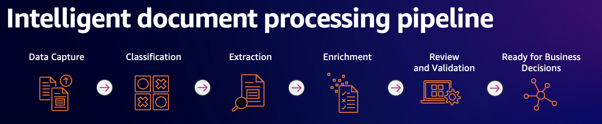
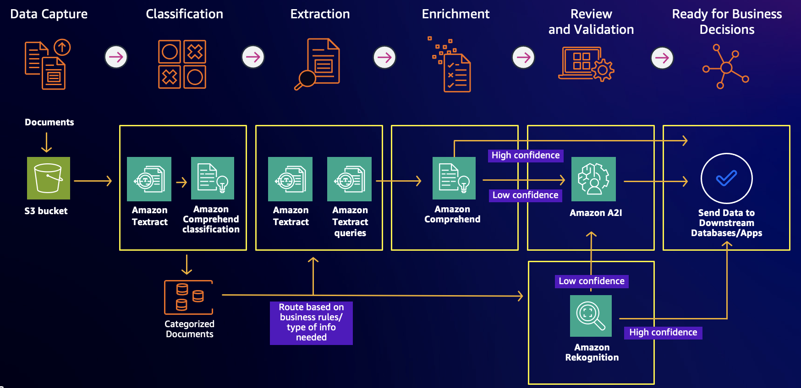

# AWS AI Services demo

With AWS AI services, you can add capabilities like image and video analysis, natural language processing, personalized recommendations and translation, virtual assistants, and speech recognition. You can use each service standalone, or you can use them together to build a sophisticated AI-capable application.

This sample application is designed to demo the usage of some of the AWS AI Services to enrich your existing .NET applications with AI capabilities using AWS SDK for .NET.

You can also see how to build an end-to-end IDP (Intelligent Document Processing) application with .NET using AWS AI services.



The following services are used in the demos:
- [Amazon Comprehend](https://aws.amazon.com/comprehend/)
- [Amazon Translate](https://aws.amazon.com/translate/)
- [Amazon Comprehend custom classification](https://docs.aws.amazon.com/comprehend/latest/dg/how-document-classification.html)
- [Amazon Textract](https://aws.amazon.com/textract/)
- [Amazon Textract Query](https://docs.aws.amazon.com/textract/latest/dg/bestqueries.html)
- [Amazon Rekognition](https://aws.amazon.com/rekognition/)

## Prerequisites

To run this solution, you will need the following:
1. An AWS Account.
1. Install and configure [AWS Command Line Interface (AWS CLI)](https://docs.aws.amazon.com/cli/latest/userguide/cli-chap-configure.html) to interact with AWS.
1. Sample application is written in .NET 8, so you need to have [.NET 8 SDK](https://dotnet.microsoft.com/en-us/download/dotnet/8.0) installed.
1. IDE of your choice to work with .NET 8 project (Visual Studio Code / Visual Studio 2022 / JetBrains Rider).

## Sample files

**Samples** folder contains 3 subfolders with images and documents that can be used for the demos:

**Insurance** folder contains set of documents that can be used for the IDP demos:



- **insurance_comprehend_train_data.csv** can be used to train Amazon Comprehend custom classifier
- **1-CMS1500.png**, **1-discharge-summary.jpg** and **1-drivers_license_alex.jpg** can be used to test custom classifier that is deployed to real-time endpoint
- **2-insurance_card.jpg** can be use to test text and forms extraction.
    - Also it can be used for Textract Queries with the following queries:
        - What is the member name?
        - What is the member id?
        - What is the PCP name?
        - What is the PCP phone number?
- **3-discharge-summary.jpg** and **3-dr-note-sample.jpg** can be used to detect PII information
- **4-id_alex.jpg**, **4-Photo_alex.jpg** and **4-Photo_prasad.jpg** can be used for identity verification demo with Amazon Rekognition

**AIServices** folder contains various set of images that can be used for demo individual AWS AI Services:

- **bbq_receipt.jpg** and **whole_foods_receipt.jpg** are sample receipts that can be used for Amazon Textract demo to analyze expenses.
- **loan_application.png** and **paystub.jpg** can be used for Amazon Textract Query demo to show how it understands context from implied and nested fields.
    - Following sample queries can be used with the **loan_application.png**:
        - What is the borrower SSN?
        - What is the co-borrower SSN?
        - What is the co-borrower name?
    - Following sample queries can be used with the **paystub.jpg**:
        - What is social security tax?
        - What is social security tax year to date?
- **beer_label.jpg** can be used to extract text from the photo using Amazon Rekognition.
- **family.jpg** can be used to demo how Amazon Rekognition can detect Personal Protective Equipment (PPE) worn by persons in an image.
- **grunt.jpg** can be used to demo how Amazon Rekognition can detect entities in an image.

**IDP** folder contains sample documents that can be used to test custom document classifier trained on the following [dataset](https://idp-assets-wwso.s3.us-east-2.amazonaws.com/workshop-data/classification-training.zip).

## How to use

For all demos, except IDP demo, just open the solution or project file in your IDE, start the application. That's it! You don't need to configure the services, or deploy any infrastructure.

For the IDP demo, you will need to do the following preparations:
- Create S3 bucket and upload **insurance_comprehend_train_data.csv** from the **Samples/Insurance** folder.
- Create IAM role with the policy that gives Amazon Comprehend access to list/read from the S3 bucket that you created:
```json
  {
    "Version": "2012-10-17",
    "Statement": [
      {
        "Action": "s3:GetObject",
        "Resource": [
          "arn:aws:s3:::YOUR-S3-BUCKET/*"
        ],
        "Effect": "Allow"
      },
      {
        "Action": "s3:ListBucket",
        "Resource": [
          "arn:aws:s3:::YOUR-S3-BUCKET"
        ],
        "Effect": "Allow"
      }
    ]
  }
```
- Update code in **IDP.cshtml.cs** to point to the S3 bucket you created and IAM role.

> [!WARNING]
> 
> Please note, that as part of IDP demo you are going to create an endpoint to run the real-time analysis.
> An endpoint includes managed resources that makes your custom model available for real-time inference.
>  
> **Your account incurs charges for the endpoint from the time it starts until you delete it.** 
>  
> So once you stop playing with the demo, delete the endpoint!